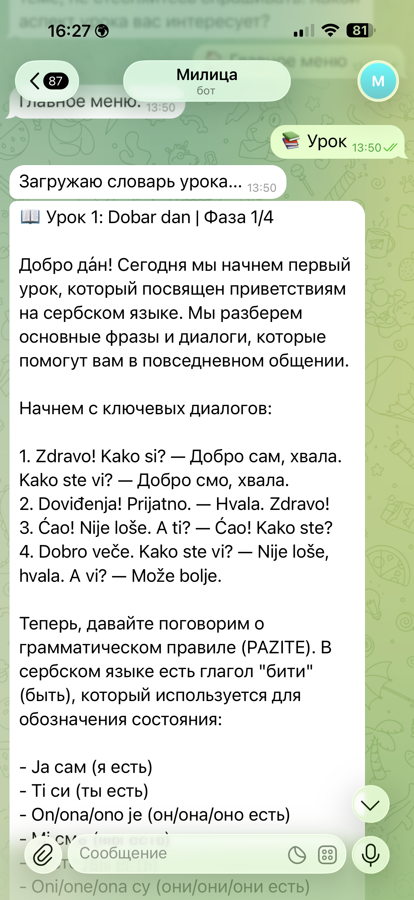
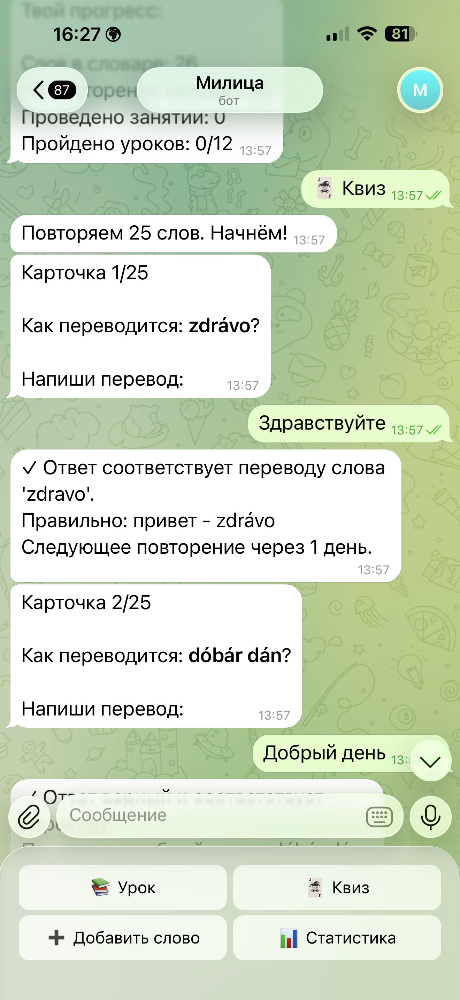
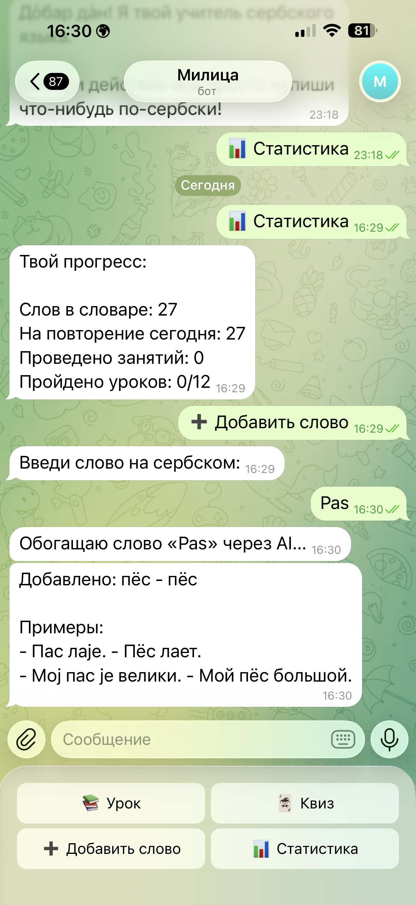
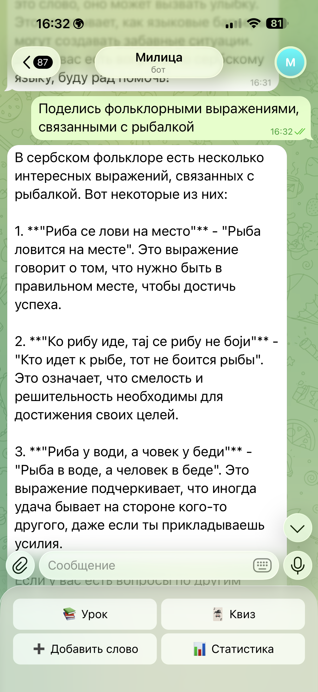

# Serbian Teacher Bot

Telegram-бот для изучения сербского языка: свободный чат с AI-учителем, уроки, квизы, словарь, интервальное повторение и статистика прогресса.

Это очищенная портфельная версия. В репозитории нет production `.env`, реального Telegram ID пользователя, учебных PDF/DOCX, приватной базы Supabase и истории занятий.

## Демо

<p align="center">
  
  
</p>
<p align="center">
  
  
</p>

Слева направо, сверху вниз: структурированный урок, квиз с интервальным повторением, добавление слова и статистика, свободная беседа с AI-учителем.

## Что показывает проект

- AI tutor workflow внутри Telegram.
- Уроки с фазами: объяснение, диалог, упражнение, тест.
- GPT-помощник для свободного чата, проверки ответов и обогащения словаря.
- Интервальное повторение слов по SM-2.
- Хранение словаря, занятий и прогресса в Supabase.
- Пользовательский Telegram UX: меню, режим урока, режим квиза, добавление слова.
- AI-assisted development: постановка задачи, проектирование workflow, реализация через coding assistants, ручная проверка и очистка для публикации.

## Пользовательский сценарий

1. Пользователь открывает бота и выбирает урок, квиз, добавление слова или статистику.
2. В режиме урока бот берет следующий непройденный lesson из Supabase и ведет занятие по фазам.
3. GPT объясняет грамматику, задает упражнения и дает обратную связь.
4. Новые слова сохраняются в словарь и попадают в повторение.
5. В режиме квиза бот показывает карточки, GPT оценивает ответ, а SM-2 рассчитывает следующее повторение.

## Стек

- Python
- python-telegram-bot
- OpenAI API
- Supabase
- python-dotenv

## Запуск

```bash
python -m venv .venv
source .venv/bin/activate
pip install -r requirements.txt
cp .env.example .env
python bot.py
```

Нужные переменные окружения:

```env
TELEGRAM_TOKEN=your_telegram_bot_token
OPENAI_API_KEY=your_openai_api_key
SUPABASE_URL=https://your-project.supabase.co
SUPABASE_KEY=your_supabase_anon_or_service_key
ALLOWED_USER_ID=123456789
```

Перед запуском нужно выполнить `schema.sql` в Supabase SQL Editor.

## Структура

```text
bot.py                      точка входа Telegram-бота
handlers/                   сценарии уроков, квизов, словаря и статистики
services/                   Supabase, curriculum, SM-2, OpenAI client
prompts/teacher.py          системный промпт учителя
keyboards.py                Telegram-клавиатуры
schema.sql                  схема Supabase и демо-программа
requirements.txt            зависимости
```

## Безопасность и данные

- Не коммитить `.env`, токены, Supabase ключи, OpenAI ключи и реальные Telegram ID.
- Не коммитить учебные PDF/DOCX и приватную историю занятий.
- `schema.sql` содержит демо-структуру. Если использовать материалы конкретного учебника или курса, нужно отдельно проверить права.
- GPT может ошибаться в переводе, ударении и оценке ответа; для учебного продукта нужны ручная проверка curriculum и тестовые сценарии.

## Портфельная рамка

Проект представлен как AI-assisted education automation prototype. Фокус: проектирование учебного workflow, промпта учителя, режима повторения, интеграции Supabase и Telegram UX, а не заявление о ручной production backend-разработке.
